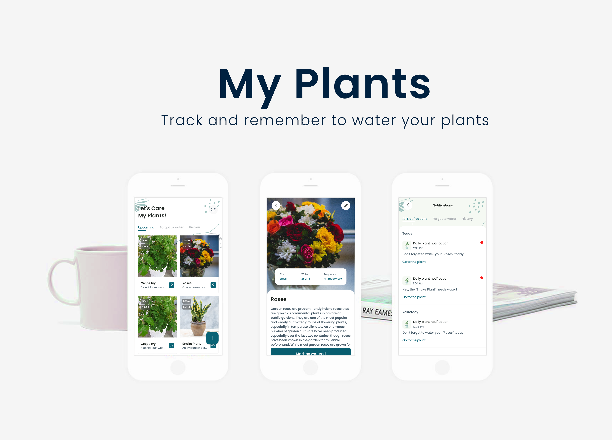

# My Plants

An application for keeping track of your plants and when to water them automatically with notifications.

## Features

- Add plants with a description, image and watering dates, which schedules regular reminders when your plants need water again!
- Filter plants by their upcoming watering date, those you have forgotten to water or view the history of when you watered your plants.
- View all the stored notifications from the app.
- View and edit existing information about your plant.
- Delete plants if they are no longer needed.

## Architecture

The app follows the official Android app architecture guidance., using the MVI (Model-View-Intent) pattern and uses Compose State to simplify
the state management for the whole application.

## Technologies

- Written completely in Kotlin
- Jetpack Compose for UI
- Hilt for dependency injection
- Room for local database
- WorkManager for local scheduled jobs
- Compose Destinations for navigation, which uses the official Navigation Component under the hood
- Coil for image loading
